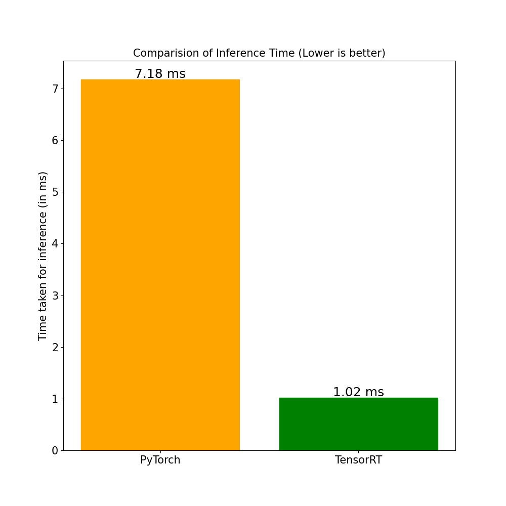

<div id="top"></div>

[![Contributors][contributors-shield]][contributors-url]
[![Issues][issues-shield]][issues-url]
[![MIT License][license-shield]][license-url]
[![LinkedIn][linkedin-shield]][linkedin-url]
<!-- [![Forks][forks-shield]][forks-url]
[![Stargazers][stars-shield]][stars-url] -->


<!-- PROJECT LOGO -->
<br />
<div align="center">
  <a href="https://github.com/deeprodge/Resnet50-with-TensorRT">
    
  </a>

  <h2 align="center">ResNet50 With TensorRT</h2>

  <p align="center">
    A ResNet50 Brain MRI Classifier that is optimized using TensorRT
    <br/>
    <!-- <a href="https://github.com/deeprodge/Resnet50-with-TensorRT"><strong>Explore the docs »</strong></a>
    <br />
    <br />
    <a href="https://github.com/deeprodge/Resnet50-with-TensorRT">View Demo</a>
    · -->
    <a href="https://github.com/deeprodge/Resnet50-with-TensorRT/issues">Report Bug</a>
    ·
    <a href="https://github.com/deeprodge/Resnet50-with-TensorRT/issues">Request Feature</a>
  </p>
</div>


<!-- TABLE OF CONTENTS -->
<details>
  <summary>Table of Contents</summary>
  <ol>
    <li>
      <a href="#about-the-project">About The Project</a>
      <ul>
        <li><a href="#more-info">More Info</a></li>
        <li><a href="#built-with">Built With</a></li>
      </ul>
    </li>
    <li>
      <a href="#getting-started">Getting Started</a>
      <ul>
        <li><a href="#prerequisites">Prerequisites</a></li>
        <!-- <li><a href="#installation">Installation</a></li> -->
      </ul>
    </li>
    <li><a href="#usage">Usage</a></li>
    <!-- <li><a href="#roadmap">Roadmap</a></li> -->
    <li><a href="#contributing">Contributing</a></li>
    <li><a href="#license">License</a></li>
    <li><a href="#contact">Contact</a></li>
    <li><a href="#useful-resources">Useful Resources</a></li>
  </ol>
</details>


<!-- ABOUT THE PROJECT -->
## About The Project
<br>
<div align="center">

</div>

<p>

It is a Brain-MRI scan classifer that classifies the scans into 4 categories: Glioma, Meningioma, Pituitary, No Tumor. It is also Implemented with TensorRT to optimizes the Inference.


</p>

### More Info
- Used ResNet50 for Transfer Learning
- Used LR scheduler while training
- Used Data Augmention to synthesise new data

<p align="right">(<a href="#top">back to top</a>)</p>


### Built With

* [Python](https://www.python.org/)
* [PyTorch](https://pytorch.org/)
* [TensorRT](https://developer.nvidia.com/tensorrt)
* [NumPy](https://numpy.org/)
* [Pandas](https://pandas.pydata.org/)
* [Pillow](https://pillow.readthedocs.io/en/stable/)


<p align="right">(<a href="#top">back to top</a>)</p>


<!-- GETTING STARTED -->
## Getting Started

Before running the scripts, you'll need to install all the NVIDIA drivers along with TensorRT 8.0+ [(TensorRT Installation Guide)](https://docs.nvidia.com/deeplearning/tensorrt/install-guide/index.html)
Or you could also use [PyTorch NGC](https://catalog.ngc.nvidia.com/orgs/nvidia/containers/pytorch) container which has all TensorRT packages installed.

### Prerequisites

To install all the required packages, run the following
  ```sh
  pip install -r requirements.txt
  ```
Download the dataset from https://www.kaggle.com/masoudnickparvar/brain-tumor-mri-dataset and split it into train, test, val set. The final dataset folder should look like this:
```
├── Dataset
│   ├── train
│   │   ├── class 0
│   │   │   └── *.jpg
│   │   .
│   │   .
│   │   └── class n
│   │       └── *.jpg
│   ├── test
│   │   ├── class 0
│   │   │   └── *.jpg
│   │   .
│   │   .
│   │   └── class n
│   │       └── *.jpg
│   ├── val
│   │   ├── class 0
│   │   │   └── *.jpg
│   │   .
│   │   .
│   │   └── class n
│   │       └── *.jpg
```

<!-- ### Installation

_Below is an example of how you can instruct your audience on installing and setting up your app. This template doesn't rely on any external dependencies or services._

1. Get a free API Key at [https://example.com](https://example.com)
2. Clone the repo
   ```sh
   git clone https://github.com/your_username_/Project-Name.git
   ```
3. Install NPM packages
   ```sh
   npm install
   ```
4. Enter your API in `config.js`
   ```js
   const API_KEY = 'ENTER YOUR API';
   ``` -->

<p align="right">(<a href="#top">back to top</a>)</p>


<!-- USAGE EXAMPLES -->
## Usage

After setting up TensorRT and installing all the packages, you can start with scripts. <br>
Each script can be run in the following way:
```sh
  python script_name.py --arguments
```
Run any script with --help to see all the arguments available.
<ul>
  <li><a href="https://github.com/deeprodge/Resnet50-with-TensorRT/blob/main/train.py">train.py</a> Train ResNet50 model on the dataset.</li>
  <li><a href="https://github.com/deeprodge/Resnet50-with-TensorRT/blob/main/create_engine.py">create_engine.py</a>: Create a TensorRT Engine that can be used later for inference.</li>
  <li><a href="https://github.com/deeprodge/Resnet50-with-TensorRT/blob/main/Inference_pytorch.py">Inference_pytorch.py</a>: Generate prediction from PyTorch Model</li>
  <li><a href="https://github.com/deeprodge/Resnet50-with-TensorRT/blob/main/Inference_trt.py">Inference_trt.py</a>: Generate prediction from TensorRT engine.</li>
  <li><a href="https://github.com/deeprodge/Resnet50-with-TensorRT/blob/main/benchmark.py">benchmark.py</a>: Compare the inference time of both PyTorch model and TensorRT engine. It also outputs a graph comparing the Inference Time.</li>
</ul>


<p align="right">(<a href="#top">back to top</a>)</p>


<!-- ROADMAP -->
<!-- ## Roadmap

- [x] Add Changelog
- [x] Add back to top links
- [ ] Add Additional Templates w/ Examples
- [ ] Add "components" document to easily copy & paste sections of the readme
- [ ] Multi-language Support
    - [ ] Chinese
    - [ ] Spanish

See the [open issues](https://github.com/deeprodge/Resnet50-with-TensorRT/issues) for a full list of proposed features (and known issues).

<p align="right">(<a href="#top">back to top</a>)</p> -->


<!-- CONTRIBUTING -->
## Contributing

Contributions are what make the open source community such an amazing place to learn, inspire, and create. Any contributions you make are **greatly appreciated**.

If you have a suggestion that would make this better, please fork the repo and create a pull request. You can also simply open an issue with the tag "enhancement".
Don't forget to give the project a star! Thanks again!

1. Fork the Project
2. Create your Feature Branch (`git checkout -b feature/AmazingFeature`)
3. Commit your Changes (`git commit -m 'Add some AmazingFeature'`)
4. Push to the Branch (`git push origin feature/AmazingFeature`)
5. Open a Pull Request

<p align="right">(<a href="#top">back to top</a>)</p>


<!-- LICENSE -->
## License

Distributed under the MIT License. See `LICENSE` for more information.

<p align="right">(<a href="#top">back to top</a>)</p>


<!-- CONTACT -->
## Contact

Deep Rodge - [LinkedIn](https://linkedin.com/in/deeprodge) - deeprodge14@gmail.com

Project Link: [https://github.com/deeprodge/Resnet50-with-TensorRT](https://github.com/deeprodge/Resnet50-with-TensorRT)

<p align="right">(<a href="#top">back to top</a>)</p>


<!-- ACKNOWLEDGMENTS -->
## Useful Resources

* [TensorRT Documentation](https://docs.nvidia.com/deeplearning/tensorrt/developer-guide/index.html)
* [PyTorch NGC Container](https://catalog.ngc.nvidia.com/orgs/nvidia/containers/pytorch)
* [Brain-MRI Dataset](https://www.kaggle.com/masoudnickparvar/brain-tumor-mri-dataset)

<p align="right">(<a href="#top">back to top</a>)</p>


<!-- MARKDOWN LINKS & IMAGES -->
<!-- https://www.markdownguide.org/basic-syntax/#reference-style-links -->
[contributors-shield]: https://img.shields.io/github/contributors/deeprodge/Resnet50-with-TensorRT.svg?style=for-the-badge
[contributors-url]: https://github.com/deeprodge/Resnet50-with-TensorRT/graphs/contributors
[forks-shield]: https://img.shields.io/github/forks/deeprodge/Resnet50-with-TensorRT.svg?style=for-the-badge
[forks-url]: https://github.com/deeprodge/Resnet50-with-TensorRT/network/members
[stars-shield]: https://img.shields.io/github/stars/deeprodge/Resnet50-with-TensorRT.svg?style=for-the-badge
[stars-url]: https://github.com/deeprodge/Resnet50-with-TensorRT/stargazers
[issues-shield]: https://img.shields.io/github/issues/deeprodge/Resnet50-with-TensorRT.svg?style=for-the-badge
[issues-url]: https://github.com/deeprodge/Resnet50-with-TensorRT/issues
[license-shield]: https://img.shields.io/github/license/deeprodge/Resnet50-with-TensorRT.svg?style=for-the-badge
[license-url]: https://github.com/deeprodge/Resnet50-with-TensorRT/blob/main/LICENSE
[linkedin-shield]: https://img.shields.io/badge/-LinkedIn-black.svg?style=for-the-badge&logo=linkedin&colorB=555
[linkedin-url]: https://linkedin.com/in/deeprodge
[product-screenshot]: images/screenshot.png
